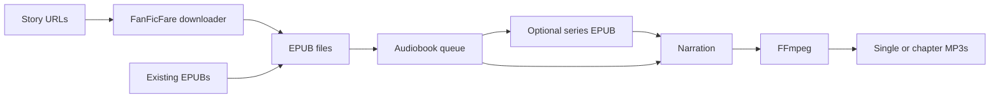

# FanFic to Audio

[](https://github.com/thatosxguy/FanFictoAudio/actions/workflows/ci.yml)
[](LICENSE)

Download fanfiction as EPUB, then turn it into an audiobook in one native Mac app. FanFic to Audio combines a SwiftUI interface, the FanFicFare download engine, and local or AI narration.

**[Download the macOS app](https://github.com/thatosxguy/FanFictoAudio/releases/latest)** · **[Installation guide](docs/installation.md)** · **[User guide](docs/usage.md)**

The packaged app requires **Apple silicon and macOS 14 or later**. Python and FanFicFare are included. MP3 creation requires a separate **FFmpeg installation with libmp3lame**, including when using AI narration. This release is ad hoc signed and **not notarized**; see the installation guide before opening it.

## What it does

- Download stories as EPUB, preview metadata, find story links, and update existing FanFicFare books with backups.
- Add several EPUBs at once, reorder the audiobook queue, pause it, and retry unsuccessful jobs.
- Follow the selected or active queue item in the open-book preview.
- Combine separate EPUBs into an ordered series without changing the originals.
- Narrate with macOS voices, OpenAI, or ElevenLabs. Provider keys are saved explicitly in macOS Keychain.
- Export one MP3 per book or a folder of numbered chapter MP3s, with title and author metadata.
- Reuse a bounded EPUB cache and avoid redundant intermediate MP3 encoding steps.



## Get started

1. Install the app and FFmpeg following the [installation guide](docs/installation.md).
2. Paste a story URL in **Download EPUB**, select a destination, then click **Download & Prepare Audiobook**. Or open an existing EPUB with **Open EPUB…** / Command-O.
3. Review the sections, select a speech provider and voice, and create an audiobook.
4. For a batch, use **Add EPUBs…**, arrange the queue, then **Create Queued Audiobooks…**. To make one series, select waiting EPUBs, enter its title, and **Combine Selected EPUBs…** first.

AI previews and exports send book text to the selected provider and may incur API charges. Local macOS narration and MP3 encoding run on your Mac. Queues last for the current app session. Read the [privacy documentation](PRIVACY.md) for stored settings, credentials, and network behavior.

## Documentation

| Guide | Covers |
| --- | --- |
| [Installation](docs/installation.md) | Release download, FFmpeg, voices, macOS security approval |
| [User guide](docs/usage.md) | Downloads, bulk queues, series merging, AI narration |
| [Troubleshooting](docs/troubleshooting.md) | Site errors, voices, API failures, unsupported EPUBs |
| [Development](docs/development.md) | Dependencies, tests, packaging, command-line tool |
| [Architecture](docs/architecture.md) | Modules, publication protocol, caching, export flow |
| [Validation](VALIDATION.md) | Verified behavior and remaining test limits |
| [Changelog](CHANGELOG.md) | Release history |
| [Contributing](CONTRIBUTING.md) | Changes, tests, useful bug reports |
| [Privacy](PRIVACY.md) / [Security](SECURITY.md) | Data handling and private vulnerability reports |

## Build from source

Use a Swift 6 toolchain, Apple's Command Line Tools or Xcode, Python 3.12, and FFmpeg:

```sh
python3.12 -m venv .venv
.venv/bin/python -m pip install -r requirements-build.txt
./Scripts/swift.sh test
PYTHONPATH="$PWD/Vendor" .venv/bin/python -m pytest -q Tests/DownloadEngineTests
./Scripts/build-app.sh
```

The app is written to `dist/FanFic to Audio.app`. See [development instructions](docs/development.md) for a clean-clone walkthrough, smoke validation, and release packaging. The supplied release is Apple silicon; an Intel app bundle has not been validated.

## Limits and attribution

Only unprotected EPUBs with readable text are supported. There is no OCR, M4B output, embedded MP3 chapter navigation, persistent queue, or checkpointed audiobook resume. Downloads and narration are separate workflow steps. Site support and authentication depend on FanFicFare; interactive login and browser challenges are not handled by this interface.

This project is licensed under [Apache 2.0](LICENSE). It includes downloader modules from FanFicFare Desktop and EPUB narration components from the EPUB to MP3 project. FanFicFare and bundled dependencies retain their own licenses; dependency notices ship inside the app. FFmpeg and Qt are not bundled. See [NOTICE](NOTICE).
